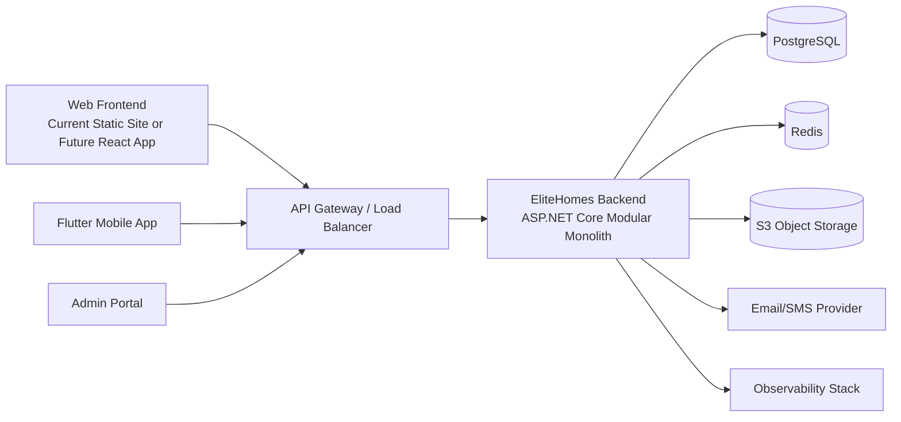
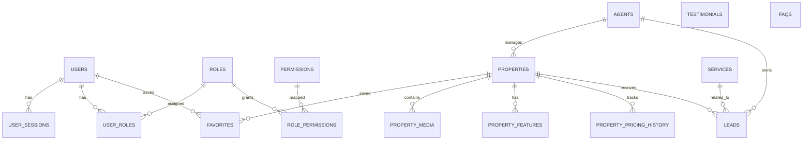
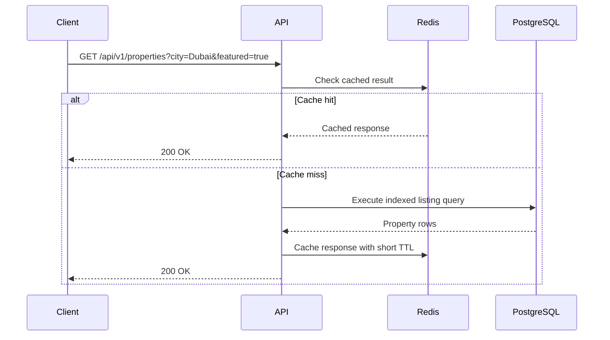
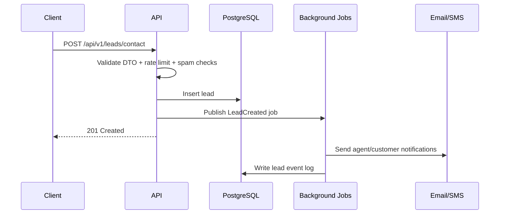
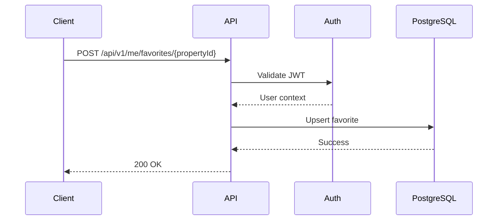
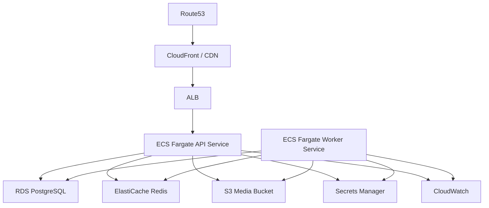

# EliteHomes Backend Architecture

## 1. Executive Summary

This document proposes a production-ready backend architecture for **EliteHomes**, a real-estate platform that currently exists as a static frontend and can evolve into a multi-client system serving:

- the current web landing page
- a future React SPA
- a future Flutter mobile app
- an internal admin portal for agents and operations staff

The backend is designed around the product flows visible in the current frontend:

- property discovery and filtering
- featured listings
- favorite/save interactions
- contact and inquiry submission
- service discovery
- testimonial and FAQ content delivery
- lead routing to agents

The recommended approach is a **modular monolith with clean architecture**, deployed as containerized services. This gives fast delivery, simpler operations, and a clean path to split high-scale domains later if needed.

## 2. Product Understanding

Based on the existing frontend, the backend must support the following business capabilities:

- property catalog management
- advanced property search
- featured listings for the homepage
- lead capture from search and contact forms
- service catalog management
- testimonial and FAQ content management
- saved favorites for authenticated users
- agent and office profile management
- analytics and operational reporting

Non-functional priorities:

- horizontal scalability
- secure authentication and authorization
- good read performance for listing discovery
- admin-friendly content workflows
- auditability for lead and listing changes
- low operational complexity for an early-stage product

## 3. Recommended Technology Stack

### 3.1 Core Stack

| Layer | Technology | Why |
|---|---|---|
| API runtime | **.NET 10 / C#** | Strong performance, mature enterprise tooling, clear long-term maintainability, and excellent observability support |
| Framework | **ASP.NET Core Web API** | Excellent structure for clean architecture, DI, validation, modular composition, and production hosting |
| API style | **REST** | Best fit for current frontend, admin workflows, caching, simple integration, SEO-friendly public content delivery |
| Database | **PostgreSQL** | Strong relational modeling for listings, inquiries, users, agents, and content |
| ORM | **Entity Framework Core** | Strong .NET integration, migrations, relational modeling, and clean repository boundaries |
| Cache | **Redis** | Query/result caching, rate limiting, job coordination, session/token revocation support |
| Search | **PostgreSQL full-text search** initially, **OpenSearch** later | PostgreSQL is enough for early scale; OpenSearch can be introduced when filters, ranking, and geo search become more complex |
| Background jobs | **Hangfire** or **Quartz.NET** | Reliable async processing, retries, scheduling, and good operational visibility in .NET |
| Object storage | **AWS S3** or compatible storage | Listing images, brochure PDFs, CMS media |
| Auth | **JWT + refresh token rotation** | Scales well for SPA/mobile/API use cases |
| Observability | **OpenTelemetry + Prometheus + Grafana + Loki/Sentry** | Tracing, metrics, logs, and exception monitoring |
| Deployment | **Docker + Kubernetes** or **AWS ECS Fargate** | Production-ready container orchestration |

### 3.2 Why REST over GraphQL

REST is recommended here because:

- the current frontend consumes page-oriented resources cleanly
- public content and listing pages map naturally to resource endpoints
- CDN and HTTP caching are easier
- admin integrations and partner integrations are simpler
- operational complexity stays lower than GraphQL for this product stage

GraphQL can be added later behind a BFF if the product evolves into multiple rich clients with complex aggregation needs.

## 4. Architectural Style

### 4.1 High-Level Pattern

Use a **modular monolith** with **clean architecture**:

- one deployable backend application
- clear module boundaries by business domain
- domain logic isolated from frameworks and infrastructure
- asynchronous event-driven workflows where useful

This is the right tradeoff because the product has multiple domains, but not enough proven scale yet to justify distributed microservice overhead.

### 4.2 Clean Architecture Layers

```text
Presentation Layer
- REST controllers
- DTOs
- auth guards
- serializers

Application Layer
- use cases
- command/query handlers
- application services
- transaction orchestration

Domain Layer
- entities
- value objects
- domain services
- repository interfaces
- domain events

Infrastructure Layer
- EF Core repositories
- Redis cache
- background jobs and workers
- S3 adapters
- email/SMS providers
- external integrations
```

### 4.3 Domain Modules

- `identity`: users, sessions, roles, permissions
- `properties`: listings, property details, media, amenities, pricing, status
- `search`: filtering, sorting, featured listings, recommendation seeds
- `favorites`: saved properties
- `leads`: contact requests, property inquiries, consultation requests
- `agents`: agent profiles, office assignments, lead ownership
- `content`: testimonials, FAQs, service categories, homepage content
- `notifications`: email, SMS, webhooks
- `analytics`: behavior events, dashboards, attribution
- `admin`: internal moderation and management use cases

## 5. High-Level System Design



### 5.1 Request Types

- public read traffic: listings, filters, agents, services, testimonials, FAQs
- authenticated user traffic: favorites, profile, saved searches
- admin traffic: CRUD for properties, content, agents, lead handling
- async workflows: notifications, image processing, lead assignment, analytics aggregation

## 6. Low-Level Module Design

### 6.1 Property Module

Responsibilities:

- manage listing lifecycle
- store property metadata and media
- expose listing details and summaries
- support filters such as price, type, location, bedrooms, bathrooms, area, and status
- mark featured, premium, or new listings

Core entities:

- `Property`
- `PropertyAddress`
- `PropertyMedia`
- `PropertyFeature`
- `PropertyAmenity`
- `PropertyPricingHistory`
- `PropertyAgentAssignment`

### 6.2 Search Module

Responsibilities:

- search listings with pagination
- filter and sort
- featured listing retrieval
- autocomplete for city/community/property type

Implementation notes:

- begin with PostgreSQL indexes and materialized query optimization
- cache common homepage and filter queries in Redis
- move to OpenSearch when scale or ranking complexity requires it

### 6.3 Lead Module

Responsibilities:

- receive contact form submissions
- receive property-specific inquiries
- assign leads to agents
- track lead status through pipeline
- store consent and attribution metadata

Lead states:

- `NEW`
- `ASSIGNED`
- `CONTACTED`
- `QUALIFIED`
- `VIEWING_SCHEDULED`
- `CLOSED_WON`
- `CLOSED_LOST`
- `SPAM`

### 6.4 Favorites Module

Responsibilities:

- allow authenticated users to save and unsave listings
- provide saved listings view
- optionally support saved searches later

### 6.5 Content Module

Responsibilities:

- FAQ management
- testimonial management
- services content management
- homepage hero/configurable content blocks

This separates frequently edited content from frontend releases.

## 7. Database Design

### 7.1 Main Entities



### 7.2 Suggested Tables

#### `users`

```sql
id UUID PK
email VARCHAR(255) UNIQUE NOT NULL
password_hash TEXT NULL
first_name VARCHAR(100) NOT NULL
last_name VARCHAR(100) NOT NULL
phone VARCHAR(30) NULL
status VARCHAR(30) NOT NULL
email_verified_at TIMESTAMP NULL
created_at TIMESTAMP NOT NULL
updated_at TIMESTAMP NOT NULL
```

#### `roles`

```sql
id UUID PK
name VARCHAR(50) UNIQUE NOT NULL
description TEXT NULL
```

#### `permissions`

```sql
id UUID PK
name VARCHAR(100) UNIQUE NOT NULL
description TEXT NULL
```

#### `user_roles`

```sql
user_id UUID FK -> users.id
role_id UUID FK -> roles.id
PRIMARY KEY (user_id, role_id)
```

#### `agents`

```sql
id UUID PK
user_id UUID FK -> users.id UNIQUE
display_name VARCHAR(150) NOT NULL
bio TEXT NULL
license_number VARCHAR(100) NULL
avatar_url TEXT NULL
specialization VARCHAR(150) NULL
is_active BOOLEAN NOT NULL DEFAULT true
created_at TIMESTAMP NOT NULL
updated_at TIMESTAMP NOT NULL
```

#### `properties`

```sql
id UUID PK
slug VARCHAR(180) UNIQUE NOT NULL
title VARCHAR(255) NOT NULL
description TEXT NOT NULL
property_type VARCHAR(50) NOT NULL
listing_type VARCHAR(50) NOT NULL
status VARCHAR(50) NOT NULL
price NUMERIC(14,2) NOT NULL
currency CHAR(3) NOT NULL DEFAULT 'USD'
bedrooms INT NULL
bathrooms INT NULL
area_sqft NUMERIC(12,2) NULL
year_built INT NULL
is_featured BOOLEAN NOT NULL DEFAULT false
is_published BOOLEAN NOT NULL DEFAULT false
hero_image_url TEXT NULL
agent_id UUID FK -> agents.id NULL
created_at TIMESTAMP NOT NULL
updated_at TIMESTAMP NOT NULL
published_at TIMESTAMP NULL
```

#### `property_addresses`

```sql
id UUID PK
property_id UUID FK -> properties.id UNIQUE
country VARCHAR(100) NOT NULL
state VARCHAR(100) NULL
city VARCHAR(120) NOT NULL
district VARCHAR(120) NULL
street_address VARCHAR(255) NULL
postal_code VARCHAR(30) NULL
latitude NUMERIC(10,7) NULL
longitude NUMERIC(10,7) NULL
```

#### `property_media`

```sql
id UUID PK
property_id UUID FK -> properties.id
media_type VARCHAR(30) NOT NULL
file_url TEXT NOT NULL
thumbnail_url TEXT NULL
sort_order INT NOT NULL DEFAULT 0
alt_text VARCHAR(255) NULL
created_at TIMESTAMP NOT NULL
```

#### `property_features`

```sql
id UUID PK
property_id UUID FK -> properties.id
feature_name VARCHAR(100) NOT NULL
feature_value VARCHAR(255) NOT NULL
```

#### `property_pricing_history`

```sql
id UUID PK
property_id UUID FK -> properties.id
old_price NUMERIC(14,2) NOT NULL
new_price NUMERIC(14,2) NOT NULL
changed_at TIMESTAMP NOT NULL
changed_by UUID FK -> users.id NULL
```

#### `favorites`

```sql
user_id UUID FK -> users.id
property_id UUID FK -> properties.id
created_at TIMESTAMP NOT NULL
PRIMARY KEY (user_id, property_id)
```

#### `services`

```sql
id UUID PK
slug VARCHAR(120) UNIQUE NOT NULL
name VARCHAR(150) NOT NULL
description TEXT NOT NULL
category VARCHAR(80) NOT NULL
is_active BOOLEAN NOT NULL DEFAULT true
sort_order INT NOT NULL DEFAULT 0
```

#### `leads`

```sql
id UUID PK
property_id UUID FK -> properties.id NULL
service_id UUID FK -> services.id NULL
assigned_agent_id UUID FK -> agents.id NULL
source VARCHAR(50) NOT NULL
lead_type VARCHAR(50) NOT NULL
status VARCHAR(50) NOT NULL
first_name VARCHAR(100) NOT NULL
last_name VARCHAR(100) NOT NULL
email VARCHAR(255) NOT NULL
phone VARCHAR(30) NULL
message TEXT NULL
budget_min NUMERIC(14,2) NULL
budget_max NUMERIC(14,2) NULL
preferred_location VARCHAR(150) NULL
consent_marketing BOOLEAN NOT NULL DEFAULT false
utm_source VARCHAR(100) NULL
utm_medium VARCHAR(100) NULL
utm_campaign VARCHAR(100) NULL
submitted_at TIMESTAMP NOT NULL
```

#### `lead_events`

```sql
id UUID PK
lead_id UUID FK -> leads.id
event_type VARCHAR(50) NOT NULL
payload JSONB NOT NULL
created_at TIMESTAMP NOT NULL
created_by UUID FK -> users.id NULL
```

#### `testimonials`

```sql
id UUID PK
author_name VARCHAR(150) NOT NULL
author_title VARCHAR(150) NULL
content TEXT NOT NULL
rating INT NOT NULL
is_published BOOLEAN NOT NULL DEFAULT true
sort_order INT NOT NULL DEFAULT 0
created_at TIMESTAMP NOT NULL
```

#### `faqs`

```sql
id UUID PK
question TEXT NOT NULL
answer TEXT NOT NULL
category VARCHAR(80) NULL
is_published BOOLEAN NOT NULL DEFAULT true
sort_order INT NOT NULL DEFAULT 0
created_at TIMESTAMP NOT NULL
```

### 7.3 Important Indexes

```sql
CREATE INDEX idx_properties_status_published ON properties(status, is_published);
CREATE INDEX idx_properties_type_price ON properties(property_type, price);
CREATE INDEX idx_properties_featured ON properties(is_featured) WHERE is_published = true;
CREATE INDEX idx_property_addresses_city_district ON property_addresses(city, district);
CREATE INDEX idx_leads_submitted_at ON leads(submitted_at DESC);
CREATE INDEX idx_leads_status_assigned_agent ON leads(status, assigned_agent_id);
CREATE INDEX idx_favorites_user_id ON favorites(user_id);
```

### 7.4 Multi-Tenant Readiness

If EliteHomes later becomes a brokerage platform for multiple offices or brands, add:

- `organization_id` to business tables
- row-level tenant scoping in repositories
- tenant-aware JWT claims

The current design supports that extension without major rework.

## 8. API Design

## 8.1 Public REST API

### Listings

```http
GET /api/v1/properties
GET /api/v1/properties/{slug}
GET /api/v1/properties/featured
GET /api/v1/properties/search/suggestions?q=dubai
```

Query parameters for `GET /properties`:

```text
page, limit, sort, city, district, propertyType, listingType,
minPrice, maxPrice, bedrooms, bathrooms, minArea, maxArea, featured
```

### Content

```http
GET /api/v1/services
GET /api/v1/testimonials
GET /api/v1/faqs
GET /api/v1/homepage
```

### Lead Capture

```http
POST /api/v1/leads/contact
POST /api/v1/leads/property-inquiry
POST /api/v1/leads/service-inquiry
POST /api/v1/search-requests
```

### Authentication

```http
POST /api/v1/auth/register
POST /api/v1/auth/login
POST /api/v1/auth/refresh
POST /api/v1/auth/logout
POST /api/v1/auth/forgot-password
POST /api/v1/auth/reset-password
POST /api/v1/auth/verify-email
```

### Favorites

```http
GET /api/v1/me/favorites
POST /api/v1/me/favorites/{propertyId}
DELETE /api/v1/me/favorites/{propertyId}
```

## 8.2 Admin REST API

```http
GET    /api/v1/admin/properties
POST   /api/v1/admin/properties
PATCH  /api/v1/admin/properties/{id}
POST   /api/v1/admin/properties/{id}/publish
POST   /api/v1/admin/properties/{id}/unpublish

GET    /api/v1/admin/leads
PATCH  /api/v1/admin/leads/{id}/assign
PATCH  /api/v1/admin/leads/{id}/status

GET    /api/v1/admin/services
POST   /api/v1/admin/services
PATCH  /api/v1/admin/services/{id}

GET    /api/v1/admin/faqs
POST   /api/v1/admin/faqs
PATCH  /api/v1/admin/faqs/{id}
```

## 8.3 Response Shape

Use a consistent envelope:

```json
{
  "data": {},
  "meta": {
    "requestId": "req_123",
    "timestamp": "2026-04-27T10:00:00Z"
  },
  "errors": []
}
```

Paginated responses:

```json
{
  "data": [],
  "meta": {
    "page": 1,
    "limit": 12,
    "total": 140,
    "totalPages": 12
  }
}
```

## 8.4 Example Listing Response

```json
{
  "data": {
    "id": "0c1f5d3e-2f7c-42f3-9c3d-5ff8d7f48111",
    "slug": "palm-jumeirah-waterfront-villa",
    "title": "Palm Jumeirah Waterfront Villa",
    "price": 4200000,
    "currency": "USD",
    "propertyType": "villa",
    "listingType": "sale",
    "status": "active",
    "bedrooms": 5,
    "bathrooms": 6,
    "areaSqft": 6800,
    "featured": true,
    "address": {
      "city": "Dubai",
      "district": "Palm Jumeirah"
    },
    "heroImageUrl": "https://cdn.example.com/properties/1/hero.jpg",
    "agent": {
      "id": "7b0eb18f-04d9-4fb1-8b67-7f9fa97f4f01",
      "displayName": "John Mitchell"
    }
  }
}
```

## 9. Authentication and Authorization

### 9.1 Authentication Model

Recommended model:

- access token: short-lived JWT, 15 minutes
- refresh token: 7 to 30 days, rotated on each refresh
- store hashed refresh tokens in database or Redis-backed session store
- email verification required for full account activation
- optional OTP or TOTP-based MFA for admin users

### 9.2 User Types

- `PUBLIC_USER`
- `REGISTERED_USER`
- `AGENT`
- `CONTENT_EDITOR`
- `OPS_MANAGER`
- `ADMIN`

### 9.3 Authorization Model

Use **RBAC** with optional resource-level rules:

- public users can read published content only
- registered users can manage their own profile and favorites
- agents can view leads assigned to them
- content editors can manage FAQs, testimonials, and services
- admins can manage properties, agents, users, and operational settings

### 9.4 Security Controls

- bcrypt or Argon2 password hashing
- refresh token rotation
- device/session revocation
- IP and identity-based rate limiting
- audit logs for admin actions
- signed URLs for private media upload

## 10. Folder Structure

```text
backend/
|-- EliteHomes.sln
|-- NuGet.Config
|-- src/
|   |-- EliteHomes.Api/
|   |   |-- Configuration/
|   |   |-- Contracts/
|   |   |-- Endpoints/
|   |   |-- Properties/
|   |   |-- Program.cs
|   |   |-- appsettings.json
|   |   `-- appsettings.Development.json
|   |-- EliteHomes.Application/
|   |   |-- Abstractions/
|   |   |-- Identity/
|   |   |-- Properties/
|   |   |-- Leads/
|   |   `-- Content/
|   |-- EliteHomes.Domain/
|   |   |-- Common/
|   |   |-- Identity/
|   |   |-- Properties/
|   |   `-- Leads/
|   `-- EliteHomes.Infrastructure/
|       |-- Persistence/
|       |-- Caching/
|       |-- Messaging/
|       `-- Storage/
|-- tests/
|   |-- Unit/
|   |-- Integration/
|   `-- EndToEnd/
|-- docs/
|-- Dockerfile
`-- docker-compose.yml
```

## 11. Key Use Cases

### 11.1 Property Search Flow



### 11.2 Contact Form Submission



### 11.3 Favorite a Property



## 12. Caching Strategy

Use Redis for:

- homepage featured listings
- FAQ, services, testimonials
- listing search result pages with short TTL
- autocomplete suggestions
- token revocation/session metadata
- rate limiting counters

TTL guidance:

- homepage blocks: 5 to 15 minutes
- public content pages: 15 to 60 minutes
- filtered search queries: 30 to 120 seconds

Invalidate cache on:

- property publish/unpublish
- property price/status changes
- service/FAQ/testimonial content updates

## 13. Background Jobs

Use background workers or scheduled jobs for:

- lead assignment and notification dispatch
- email verification and password reset emails
- image optimization and thumbnail generation
- stale cache invalidation
- analytics aggregation
- CRM sync with external systems

Keep HTTP requests fast by moving non-critical work to background jobs.

## 14. Deployment Strategy

### 14.1 Environments

- `local`
- `dev`
- `staging`
- `production`

### 14.2 Containerization

- package API as a Docker image
- run database migrations during deployment
- run workers as separate processes or separate services
- externalize config via environment variables and secret manager

### 14.3 Recommended AWS Deployment



### 14.4 CI/CD

Pipeline steps:

1. lint
2. unit tests
3. integration tests
4. build image
5. security scan
6. deploy to staging
7. smoke tests
8. production approval
9. blue/green or rolling deploy

## 15. Security Best Practices

### 15.1 Application Security

- validate all request payloads with strict DTO schemas
- sanitize rich text and user-provided content
- enforce HTTPS everywhere
- use secure headers with Helmet
- enable CORS only for approved origins
- apply CSRF protection if cookie-based auth is ever introduced
- return generic auth error messages
- avoid leaking internal IDs where public slugs suffice

### 15.2 Data Security

- encrypt data in transit with TLS
- encrypt database and object storage at rest
- store secrets in a vault or secret manager
- hash passwords with Argon2 or bcrypt
- store refresh tokens hashed, not plaintext
- log sensitive access and admin mutations

### 15.3 Abuse Prevention

- rate limit login, password reset, and lead submission endpoints
- add CAPTCHA or invisible bot detection on public forms
- use email and phone verification where needed
- detect duplicate/spam leads
- throttle expensive search endpoints

## 16. Performance Considerations

### 16.1 Read Performance

- paginate all listing endpoints
- select only needed columns for list views
- denormalize lightweight summary fields where justified
- use covering indexes for common filters
- cache hot listing and content endpoints

### 16.2 Write Performance

- keep writes transactional but short
- push notifications and analytics to async jobs
- batch audit/event inserts where possible

### 16.3 Scalability Path

Phase 1:

- PostgreSQL + Redis only
- modular monolith

Phase 2:

- add read replicas
- add OpenSearch for advanced search
- separate workers

Phase 3:

- split high-scale domains if proven necessary, likely `search`, `notifications`, or `analytics`

## 17. Observability and Operations

Implement:

- structured JSON logs with correlation IDs
- request tracing across API and workers
- metrics for p95 latency, DB query time, cache hit rate, queue depth
- alerting on error rate, lead pipeline failures, and auth anomalies

Critical dashboards:

- property search latency
- lead submission success rate
- notification delivery failures
- admin activity audit summary
- DB CPU, memory, connections, slow queries

## 18. Data Governance and Auditability

Track:

- who created or edited a property
- property publishing history
- lead assignment changes
- admin content changes
- login and session history for privileged users

Use:

- `created_at`, `updated_at`, `created_by`, `updated_by`
- append-only event tables for sensitive workflows

## 19. API Versioning

Use URI versioning:

```text
/api/v1/...
```

Rules:

- additive changes do not require a new version
- breaking response or behavior changes move to `/v2`
- deprecate old versions with clear sunset timelines

## 20. Suggested Delivery Roadmap

### Phase 1: Core Backend MVP

- auth
- public listings API
- content API
- lead capture API
- admin property CRUD
- PostgreSQL + Redis

### Phase 2: Operational Maturity

- favorites
- agent assignment workflows
- email/SMS notifications
- audit logs
- dashboards

### Phase 3: Scale and Product Depth

- saved searches
- recommendation logic
- CRM integrations
- OpenSearch
- mobile-specific optimizations

## 21. Final Recommendation

The best backend for EliteHomes today is an **ASP.NET Core modular monolith** on **.NET**, using **PostgreSQL** for core data, **Redis** for caching and queues, **REST APIs** for client access, and a background job processor such as **Hangfire** or **Quartz.NET** for asynchronous workflows.

This architecture is:

- production-ready
- aligned with clean architecture
- fast to deliver
- simple to operate
- scalable enough for significant growth
- flexible enough to support the current site and future React or Flutter clients

If the next step is implementation, start with these modules first:

1. `identity`
2. `properties`
3. `content`
4. `leads`
5. `admin`

That sequence delivers visible business value quickly while preserving a clean foundation.
