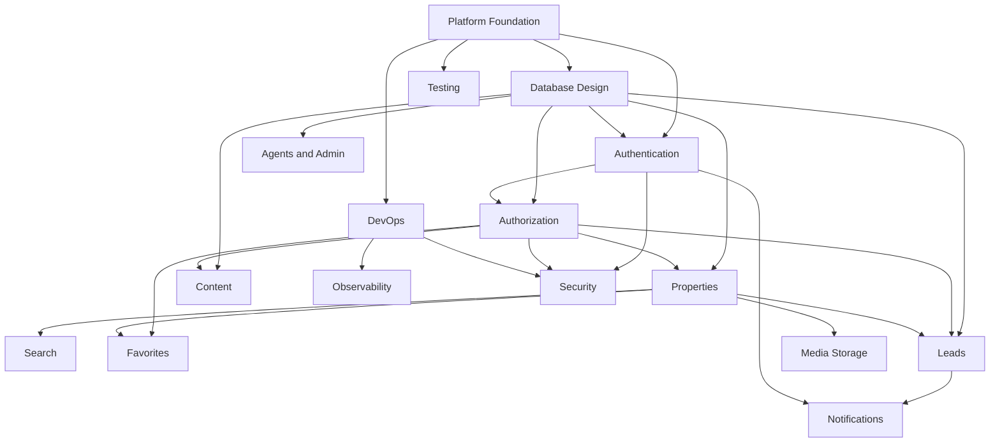

# EliteHomes Backend Task Breakdown

## 1. Goal

This document breaks the **EliteHomes backend architecture** into execution tasks so a team can work in parallel with clear ownership, dependencies, and delivery order.

It is designed for a backend team building:

- core API
- admin capabilities
- authentication
- listing management
- inquiry handling
- content management
- infrastructure and deployment

## 2. Team Structure Recommendation

Recommended team split:

- **Team A: Platform & Architecture**
- **Team B: Identity & Security**
- **Team C: Properties & Search**
- **Team D: Leads & Notifications**
- **Team E: Content & Admin**
- **Team F: DevOps & Observability**

If the team is smaller, one person can own multiple workstreams.

## 3. Delivery Phases

### Phase 1: Foundation

Goal:
Establish backend skeleton, standards, infrastructure, and shared tooling.

### Phase 2: Core Business Features

Goal:
Implement the main user-facing backend capabilities.

### Phase 3: Admin and Operational Maturity

Goal:
Support internal operations, auditing, notifications, and scalability.

### Phase 4: Hardening and Production Readiness

Goal:
Security, performance, testing, deployment safety, and monitoring.

## 4. Workstream Breakdown

## Workstream A: Platform Foundation

### Objective

Set up the backend project and enforce architectural standards.

### Tasks

1. Initialize backend project with `ASP.NET Core Web API + .NET`.
2. Set up module structure based on clean architecture.
3. Configure environment management.
4. Configure ESLint, Prettier, Husky, and lint-staged.
5. Set up global validation, exception filters, and response formatting.
6. Configure Entity Framework Core and database connection.
7. Add health check endpoints.
8. Create shared libraries for:
   - base entities
   - API response envelopes
   - pagination
   - error handling
   - request context and correlation IDs
9. Create shared configuration for logging and telemetry.
10. Write backend coding conventions and contribution guide.

### Deliverables

- running backend skeleton
- clean architecture folder structure
- shared framework utilities
- local development setup

### Dependencies

- none

### Owner

- Team A

## Workstream B: Database Design and Persistence

### Objective

Build the core relational schema and migration strategy.

### Tasks

1. Convert architecture database design into `Entity Framework Core` entities and `DbContext`.
2. Define enums for:
   - property status
   - listing type
   - property type
   - lead status
   - role names
3. Create tables for:
   - users
   - roles
   - permissions
   - user_roles
   - agents
   - properties
   - property_addresses
   - property_media
   - property_features
   - property_pricing_history
   - favorites
   - services
   - leads
   - lead_events
   - testimonials
   - faqs
4. Add indexes for high-volume queries.
5. Create migration strategy for all environments.
6. Seed initial data:
   - roles
   - permissions
   - services
   - FAQs
   - testimonials
7. Add DB backup and restore runbooks.

### Deliverables

- EF Core model and `DbContext`
- SQL migrations
- seed scripts
- DB documentation

### Dependencies

- Workstream A

### Owner

- Team A or Team B

## Workstream C: Identity and Authentication

### Objective

Implement secure authentication and user session flows.

### Tasks

1. Build user registration endpoint.
2. Build login endpoint.
3. Build refresh token flow with token rotation.
4. Build logout and session revocation.
5. Build forgot-password and reset-password flows.
6. Build email verification flow.
7. Implement password hashing with `Argon2` or `bcrypt`.
8. Create JWT strategy and auth guards.
9. Design refresh token storage and hashing.
10. Add rate limiting on auth endpoints.
11. Add admin MFA support design, optional in first release.
12. Create session audit logging.

### Deliverables

- auth module
- JWT guards
- refresh token flow
- password reset flow
- email verification flow

### Dependencies

- Workstream A
- Workstream B

### Owner

- Team B

## Workstream D: Authorization and Access Control

### Objective

Implement role-based access control for public, user, agent, editor, and admin operations.

### Tasks

1. Implement role and permission model.
2. Build authorization guards.
3. Add decorators for role and permission checks.
4. Protect admin endpoints.
5. Protect agent-only lead endpoints.
6. Protect user-specific endpoints such as favorites.
7. Add authorization tests for sensitive routes.

### Deliverables

- RBAC system
- protected route policies
- authorization test coverage

### Dependencies

- Workstream B
- Workstream C

### Owner

- Team B

## Workstream E: Properties Module

### Objective

Implement listing management and public listing retrieval.

### Tasks

1. Create property domain entities and repository contracts.
2. Build admin property CRUD endpoints.
3. Build property publish and unpublish flows.
4. Build public property listing endpoint.
5. Build property details endpoint by slug.
6. Build featured properties endpoint.
7. Implement property media upload metadata handling.
8. Implement pricing history tracking.
9. Add property validation rules.
10. Add property serialization for list and detail views.

### Deliverables

- property module
- public property endpoints
- admin property endpoints
- publish workflow

### Dependencies

- Workstream A
- Workstream B
- Workstream D for admin protection

### Owner

- Team C

## Workstream F: Search Module

### Objective

Support property discovery and efficient filtering.

### Tasks

1. Design search request DTOs and query contracts.
2. Build filtered property search endpoint.
3. Add sorting options:
   - newest
   - price low to high
   - price high to low
   - featured
4. Add pagination support.
5. Implement city and district filters.
6. Implement property type and listing type filters.
7. Implement price, bedroom, bathroom, and area filters.
8. Add featured query caching in Redis.
9. Add search suggestions endpoint.
10. Define future OpenSearch integration boundary.

### Deliverables

- search API
- indexed query strategy
- caching rules

### Dependencies

- Workstream B
- Workstream E

### Owner

- Team C

## Workstream G: Favorites Module

### Objective

Allow authenticated users to save listings.

### Tasks

1. Build add favorite endpoint.
2. Build remove favorite endpoint.
3. Build current user favorites listing endpoint.
4. Prevent duplicate saves.
5. Add authenticated access checks.
6. Add unit and integration tests.

### Deliverables

- favorites API
- authenticated user favorites flow

### Dependencies

- Workstream C
- Workstream D
- Workstream E

### Owner

- Team C or Team B

## Workstream H: Leads and Inquiry Management

### Objective

Capture and manage leads from contact and property inquiry forms.

### Tasks

1. Build general contact lead endpoint.
2. Build property-specific inquiry endpoint.
3. Build service inquiry endpoint.
4. Build lead validation and anti-spam checks.
5. Store consent and attribution metadata.
6. Add duplicate lead detection strategy.
7. Add lead event logging.
8. Build internal lead retrieval endpoint for admin users.
9. Build lead assignment endpoint.
10. Build lead status update endpoint.

### Deliverables

- lead capture API
- lead management API
- lead audit trail

### Dependencies

- Workstream B
- Workstream D
- Workstream E for property relation

### Owner

- Team D

## Workstream I: Notifications and Background Jobs

### Objective

Handle async processing without slowing API requests.

### Tasks

1. Set up a .NET background job processor such as `Hangfire`.
2. Build `LeadCreated` job.
3. Build email notification handlers for:
   - new lead alerts
   - user confirmation emails
   - password reset emails
   - email verification emails
4. Build lead assignment notification flow.
5. Add retry strategy and dead-letter handling.
6. Add worker logging and metrics.
7. Create queue failure alerting.

### Deliverables

- worker service
- notification jobs
- queue monitoring

### Dependencies

- Workstream C
- Workstream H
- Workstream J if external providers are included

### Owner

- Team D

## Workstream J: Content Module

### Objective

Serve editable homepage content without frontend redeploys.

### Tasks

1. Build public services endpoint.
2. Build public testimonials endpoint.
3. Build public FAQs endpoint.
4. Build homepage content aggregation endpoint.
5. Build admin CRUD endpoints for services.
6. Build admin CRUD endpoints for FAQs.
7. Build admin CRUD endpoints for testimonials.
8. Add publish and sort-order support.
9. Add cache invalidation after content updates.

### Deliverables

- content API
- admin content management APIs

### Dependencies

- Workstream B
- Workstream D

### Owner

- Team E

## Workstream K: Agents and Admin Operations

### Objective

Support internal staff management and agent-facing workflows.

### Tasks

1. Build agent profile CRUD.
2. Link agents to user accounts.
3. Build agent list endpoint for public property details.
4. Build admin dashboard summary endpoint.
5. Build agent lead view endpoint.
6. Build internal activity audit endpoint.

### Deliverables

- agents module
- internal admin endpoints
- agent operations support

### Dependencies

- Workstream B
- Workstream C
- Workstream D
- Workstream H

### Owner

- Team E

## Workstream L: File Storage and Media

### Objective

Support property image upload and storage.

### Tasks

1. Integrate S3 or compatible object storage.
2. Implement signed upload URL generation.
3. Build media metadata save endpoint.
4. Add image validation rules.
5. Add optional thumbnail generation pipeline.
6. Create media cleanup strategy for deleted properties.

### Deliverables

- storage adapter
- media upload flow
- file lifecycle rules

### Dependencies

- Workstream A
- Workstream E

### Owner

- Team A or Team C

## Workstream M: DevOps, Deployment, and Infrastructure

### Objective

Prepare the backend for team development and production deployment.

### Tasks

1. Write `Dockerfile`.
2. Write `docker-compose.yml` for local development.
3. Provision PostgreSQL, Redis, and object storage for dev/staging/prod.
4. Create CI pipeline:
   - lint
   - test
   - build
   - security scan
5. Create CD pipeline for staging and production.
6. Add secrets management.
7. Add migration execution to deployment workflow.
8. Add rollback plan.
9. Add blue/green or rolling deploy support.

### Deliverables

- containerized backend
- CI/CD pipeline
- environment deployment strategy

### Dependencies

- Workstream A

### Owner

- Team F

## Workstream N: Observability and Monitoring

### Objective

Make the system measurable, debuggable, and supportable.

### Tasks

1. Add structured JSON logging.
2. Add request ID and correlation ID support.
3. Add Prometheus metrics.
4. Add health and readiness checks.
5. Add error monitoring with Sentry or equivalent.
6. Add tracing with OpenTelemetry.
7. Build dashboards for:
   - API latency
   - DB performance
   - cache hit rate
   - queue depth
   - lead creation success rate
8. Add production alerts.

### Deliverables

- logs
- metrics
- traces
- dashboards
- alerts

### Dependencies

- Workstream A
- Workstream I
- Workstream M

### Owner

- Team F

## Workstream O: Security Hardening

### Objective

Reduce application and infrastructure risk before production.

### Tasks

1. Add Helmet and secure headers.
2. Configure strict CORS policy.
3. Add endpoint rate limiting.
4. Add public-form abuse protection.
5. Audit secret handling.
6. Review token security and revocation logic.
7. Verify password storage policy.
8. Add security logging for suspicious activity.
9. Run dependency vulnerability scans.
10. Run API security review.

### Deliverables

- security controls
- abuse protection
- security checklist

### Dependencies

- Workstream C
- Workstream D
- Workstream M

### Owner

- Team B and Team F

## Workstream P: Testing and Quality Assurance

### Objective

Ensure the backend is correct, stable, and safe to release.

### Tasks

1. Set up unit test structure.
2. Set up integration test structure.
3. Set up end-to-end test environment.
4. Add test factories and seed fixtures.
5. Write tests for:
   - auth flows
   - property CRUD
   - listing search
   - lead submission
   - authorization guards
   - content APIs
6. Add API contract tests.
7. Add smoke tests for staging.

### Deliverables

- automated tests
- test fixtures
- release confidence checks

### Dependencies

- Workstream A
- most feature workstreams

### Owner

- Shared across all teams, coordinated by Team A

## 5. Suggested Sprint Breakdown

## Sprint 1

- Workstream A
- Workstream B
- Workstream M initial setup
- Workstream P initial test framework

## Sprint 2

- Workstream C
- Workstream D
- Workstream E initial property CRUD
- Workstream J public content APIs

## Sprint 3

- Workstream F
- Workstream H
- Workstream L
- Workstream N initial observability

## Sprint 4

- Workstream G
- Workstream I
- Workstream K
- Workstream O

## Sprint 5

- performance tuning
- staging hardening
- full regression testing
- production deployment preparation

## 6. Parallel Work Plan

These streams can start early and run in parallel:

- Team A starts platform foundation
- Team F starts CI/CD and container setup
- Team B prepares auth design and RBAC design
- Team C prepares property and search contracts
- Team E prepares content and admin DTOs

These streams depend on schema and foundation completion:

- full auth implementation
- property persistence
- favorites
- lead persistence
- content CRUD

These streams should start once core modules are stable:

- notifications
- observability dashboards
- security hardening
- performance tuning

## 7. Dependency Map

## 8. Suggested Ownership by Role

If your team is role-based instead of stream-based:

- **Backend Lead**
  - architecture decisions
  - coding standards
  - PR review quality
  - cross-team dependency management

- **Backend Engineers**
  - module implementation
  - tests
  - endpoint design
  - DB integrations

- **DevOps Engineer**
  - CI/CD
  - environments
  - deployment automation
  - monitoring

- **QA Engineer**
  - test planning
  - regression coverage
  - staging verification

- **Security Engineer**
  - auth review
  - secret management
  - abuse prevention checks

## 9. Definition of Done

A task is considered done when:

1. code is merged
2. tests pass
3. API documentation is updated
4. observability hooks are added where relevant
5. security checks are satisfied
6. migration impact is reviewed
7. staging verification is completed

## 10. Recommended First Milestone

The first milestone should deliver:

- project skeleton
- database schema
- authentication
- public properties API
- public content API
- lead submission API
- admin property CRUD

This is the smallest useful backend release for the current EliteHomes frontend.
